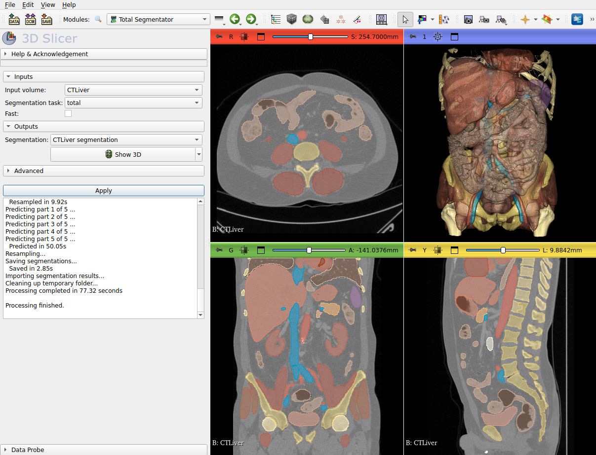

# TotalSegmentator

3D Slicer extension for fully automatic whole body CT segmentation using ["TotalSegmentator" AI model](https://github.com/wasserth/TotalSegmentator). Computation time is less than one minute.

If you use the TotalSegmentator nn-Unet function from this software in your research, please cite:

> Wasserthal J., Meyer M., , Hanns-Christian Breit H.C., Cyriac J., Shan Y., Segeroth, M.: TotalSegmentator: robust segmentation of 104 anatomical structures in CT images. https://arxiv.org/abs/2208.05868

## Setup

1. Setup your GPU driver (optional)

If you have a powerful NVIDIA GPU then a full-quality segmentation can be computed in a few minutes (instead of 40-50 minutes on the CPU). Therefore, it is recommended to set up the correct graphics driver and CUDA version if such GPU is available. Currently, CUDA is not available on macOS.

- If a CUDA-capable GPU with 7GB or more memory is available: Make sure CUDA is installed. [CUDA version must be one of those listed on pytorch website as "Compute platform" for your system](https://pytorch.org/get-started/locally/). You can download CUDA from [here](https://developer.nvidia.com/cuda-downloads).
- If CUDA-capable GPU is not available or the GPU has less than 7GB memory: CUDA installation is not necessary, everything will still work, it will just take more time.

2. Install latest version of [3D Slicer](https://slicer.readthedocs.io/en/latest/user_guide/getting_started.html#installing-3d-slicer)

3. [Install `TotalSegmentator` extension in 3D Slicer](https://slicer.readthedocs.io/en/latest/user_guide/extensions_manager.html#install-extensions)

## Tutorial

- Start 3D Slicer
- Go to `Sample Data` module and load `CTA Abdomen (Panoramix)` data set
- Go to `TotalSegmentator` module
- Select `Input volume` -> `Panoramix-cropped`
- Select `Segmentation` -> `Create new segmentation`
- Click `Apply`
  - When this module is used the first time, it needs to download and install PyTorch and TotalSegmentator Python packages and weights for the AI models. This can take 5-10 minutes and several GB disk space.
  - Expected computation time:
    - With CUDA-capable GPU: 20-30 seconds in fast mode, 40-50 seconds in full-resolution mode.
    - Without GPU: 1 minute in fast mode, 40-50 minutes in full-resolution mode.
- To display the segmentation in 3D: click the `Show 3D` button

## User interface

- Inputs
  - Input volume: input CT image
  - Segmentation task: instead of the default "total" segmentation, a more specialized segmentation model can be chosen
  - Fast: performs segmentation faster, but at lower resolution
- Outputs
  - Segmentation: it will contain a brain segment, which specifies the brain region
  - Show 3D: show/hide segments in 3D views
- Advanced:
  - Use standard segment names: use names defined in standard terminology files from [DCMQI](https://github.com/QIICR/dcmqi) (enabled by default). If disabled then TotalSegmentator identifiers will be used as segment names.
  - Upgrade: upgrade the AI engine - TotalSegmentator Python package - to the very latest version from GitHub.
  - Get TotalSegmentator package information: retrieve installed version of the AI engine - TotalSegmentator Python package.

## Troubleshooting

### Segmentation fails while predicting

If segmentation fails while predicting and the `RuntimeError: CUDA out of memory.` message is found in the message log (textbox under the Apply button) then it means that a CUDA-capable GPU is available, but it is not powerful enough to be used by TotalSegmentator. In this case, it is recommended to switch to use the CPU by the following steps:
- Go to `PyTorch Util` module, click `Uninstall PyTorch`. An error may be reported at the end of this step, as some PyTorch files are in use. Click `Restart the application` button to unload all PyTorch files.
- Go to `PyTorch Util` module, select `cpu` as `Computation backend`, and click `Install PyTorch`.

If your GPU has more than 7GB memory and you still get this error then the error message might indicate that the PyTorch CUDA version does not match the CUDA version installed on the system. Reinstall PyTorch with the correct CUDA version by following the instructions given below for [GPU is not found](#gpu-is-not-found).

### GPU is not found

If the computer has a CUDA-capable GPU but TotalSegmentator reports that GPU is not available then CUDA may not be installed on the system or CUDA version in PyTorch does not match the system CUDA version.
- Make sure that the the CUDA vesion installed on the system [is one of those listed on pytorch website as "Compute platform" for your system](https://pytorch.org/get-started/locally/). You can download CUDA from [here](https://developer.nvidia.com/cuda-downloads).
- Go to `PyTorch Util` module, click `Uninstall PyTorch`. An error may be reported at the end of this step, as some PyTorch files are in use. Click `Restart the application` button to unload all PyTorch files.
- Go to `PyTorch Util` module, select the `Computation backend` that matches the system CUDA version, and click `Install PyTorch`. The CUDA computational backend name has the format `cuNNN`, where _NNN_ corresponds to the CUDA major+minor version. For example, CUDA 11.7 backend name is `cu117`.

### Face segment is inaccurate

There is a big segment called `face` at the front of the head. This segment is not designed to match the shape of an anatomical feature, but it designates the general area of the face. It can be used to remove features (for example by masking or blurring the image or clipping models) that might otherwise identify the individual subject. Removing these features makes it easier to share 3D data.

## Contact

Please post any questions to the [Slicer Forum](https://discourse.slicer.org).

Developers of this extension are not associated with the developers of TotalSegmentator, just provide the convenient 3D Slicer based user interface.
